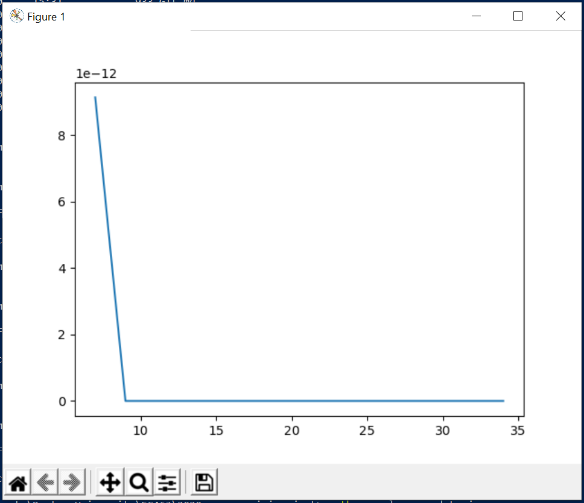
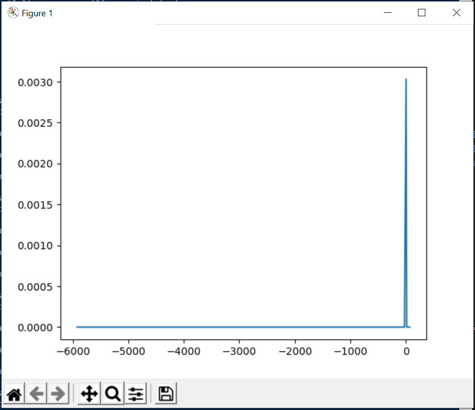
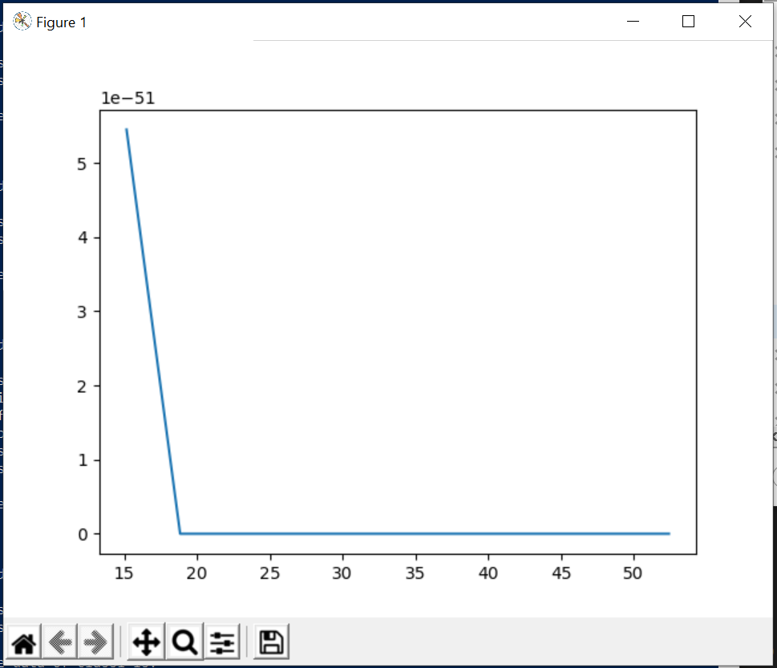

# Task 0

The welcome message sent to the client upon initial conncetion with the server is "ECE Senior Capstone IoT simulator". Disappointingly dull.

# Task 1

I added code to client.py so that the data the client receives is placed in a file, the file name being an argument passed to the program in the command line. I wrote the JSON data to the file be using file handles, rather than changing standard out from the command line to the file. This meant that the JSON data was printed to the command line and also written to the file.

# Task 2

Using statistics and scipy.stats I calculated the median and variance of the temperature and occupancy data for class1 and plotted the Probability Density Function (PDF) of the temperature, occupancy and co2 levels of the same room. 

# Occupancy PDF

# Temperature PDF

# CO2 PDF

# Task 3

A persistent change in temperature doesn't necessarily mean that the sensor is broken. For example, if the sensor is placed by a door, which it might well be if the 3 sensors are all installed together, since a sensor is counting the occupancy it would make sense to count who is going in and out of the room. If the temperature sensor is by the door then it could be regularly exposed to hotter or colder air depending on the climate which could lead to readings that are outside the usual range of expected values. For the ratio of temperature values that the algorithm removed (0.06), I would say the sensor is working well. However if that ratio grew larger, above what the technical specification of the manufacturer gave, it would be deemed faulty. 

