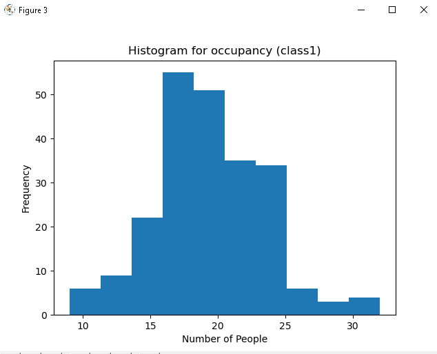
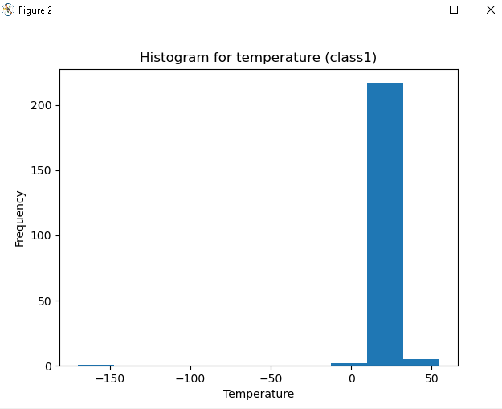
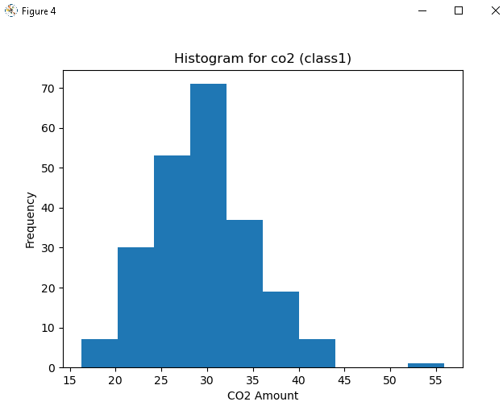
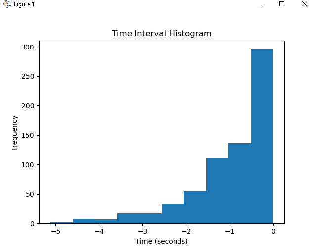

# Task 0

The welcome message sent to the client upon initial conncetion with the server is "ECE Senior Capstone IoT simulator".

# Task 1

I added code to client.py so that the data the client receives is placed in a file, the file name being an argument passed to the program in the command line. I wrote the JSON data to the file be using file handles, rather than changing standard out from the command line to the file. This meant that the JSON data was printed to the command line and also written to the file.

# Task 2

Using statistics and scipy.stats I calculated the median and variance of the temperature and occupancy data for class1 and plotted the Probability Density Function (PDF) of the temperature, occupancy and co2 levels of the same room. 

1) Median for class1 Temperature: 27.005. Variance for class1 Temperature: 182.312.
2) Median for class1 Occupancy: 19.0. Variance for class1 Occupancy: 16.84.

# Occupancy PDF

# Temperature PDF

# CO2 PDF

# Time PDf

The mean and variance of the time interval are -0.964 and 0.903 respectively.

# Histograms

For time histogram, I used pandas.Series to gather the interval time data after which I calculate mean and variance using mean() and var() respectively. I do get a negative mean value, and this might be explained by not putting the time_data in descending order. 

# Task 3

1. Percent of "bad data points", temperature median and variance with bad data points discarded.
Temperature median = 27.003
Temperature variance = 0.303

2. Does a persistent change in temperature always indicate a failed sensor?
A persistent change in temperature doesn't necessarily mean that the sensor is broken. For example, if the sensor is placed by a door, which it might well be if the 3 sensors are all installed together, since a sensor is counting the occupancy it would make sense to count who is going in and out of the room. If the temperature sensor is by the door then it could be regularly exposed to hotter or colder air depending on the climate which could lead to readings that are outside the usual range of expected values. For the ratio of temperature values that the algorithm removed (0.06), I would say the sensor is working well. However if that ratio grew larger, above what the technical specification of the manufacturer gave, it would be deemed faulty. 

2. What are possible bounds on temperature for each room type?
The bounds on each rooms temperature would be expected to be different, given the different numbers of warm bodies in each, between the office, class and lab. Certain experiments could also produce more heat in the lab which would raise the ambient temperature of that room. 

3. 

# Task 4

1) How is this simulation reflective of the real world?
The simulation is reflective of the real world that the data only varies by a small amount each time a packet is sent, in the sense of the temperature. 

2) How is this simulation deficient? What factors does it fail to account for? 
Since I didn't run the simulation through the night, I cannot talk about how good it is at simulating co2 and occupancy levels out of work hours. You would expect both to be very low level in reality, but I am sure that if I ran the simulation at night I would get data values that would be more fitting of day-time activity.

3) How is the difficulty of initially using this Python websockets library as compared to a compiled language e.g. C++ websockets?
We do not have much experience using C++ or python websockets. From a first-time user's perspective, python websockets library seems relatively simple to use since it set up most of the procedures for us, and it made it really easy to follow along as per the README. I would assume the difficulty of using C++ websockets would be much higher
since it would involve a more round-a-bout way to set up the requirements.

4) Would it be better to have the server poll the sensors, or the sensors reach out to the server when they have data?
It would be better to have the server poll the sensors since it leads to fewer wasted resources from avoiding waiting for sensors to reach out. Servers polling the sensors when needed is a lot more efficient than having the sensors reach out to the servers when data needs to be shared.

